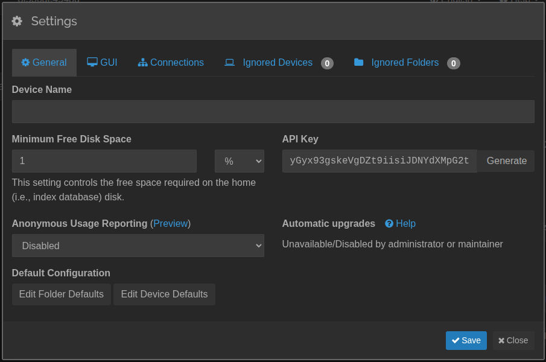

# SyncThing Linker

This tool links files from a source folder to a destination folder when a file was uploaded via Syncthing and the
ItemFinished event was fired.

If the linker didn't run for a while and events where lost, there is a script to check all files in the source if it's
also present in destination.

By running `docker compose run -it syncthing-linker-linker python missing_files.py` you can run the missing files script
on the host. For this to work, it's not necessary to have Syncthing running, but the syncthing-linker container must be
running.

# DONT USE THE docker-compose.yaml DIRECTLY

If you have Syncthing running already on the same host, you shouldn't use the docker-compose.yaml directly
but follow the installation instructions below.

## Prerequisites

An external docker network was created with the name "syncthing".

```bash
docker network create syncthing
```

Syncthing is installed with a general files folder in which source and destination subfolders were created.

All Syncthing folders are configured to be in files/sources/* e.G. files/sources/my-camera-folder

A minimal installation to configure Syncthing looks like this:

docker-compose.yaml
```yaml
networks:
  syncthing:
    external: true

volumes:
  files:
    driver: local
    driver_opts:
      o: bind
      type: none
      device: ${FILES_FOLDER:-./files}

services:
  syncthing:
    image: lscr.io/linuxserver/syncthing:latest
    volumes:
      - /srv/Syncthing/config:/config
      - files:/files
    environment:
      - PUID=1000
      - PGID=1000
      - TZ=Europe/Berlin
    ports:
      #- 8384:8384
      - 22000:22000/tcp
      - 22000:22000/udp
      - 21027:21027/udp
    restart: unless-stopped
    networks:
      - syncthing
```
.env:
```env
FILES_FOLDER=/mnt/Docker/Syncthing/files
```

## Installation

The linker needs the Syncthing API key to connect to the Syncthing server. This key can be found in the Syncthing web 
interface under `Actions → Settings → API Key`.



Having the prerequisites in place, which follows the best practice for the `syncthing-linker`, the installation looks like this:

docker-compose.yaml
```yaml
networks:
  syncthing:
    external: true

volumes:
  files:
    driver: local
    driver_opts:
      o: bind
      type: none
      device: ${FILES_FOLDER:-./files}

services:
  linker:
    image: evoweb/syncthing-linker:${TAG:-latest}
    volumes:
      - files:/files
    environment:
      PUID: 1000
      PGID: 1000
      TZ: Europe/Berlin
      SYNCTHING_HOST: "${SYNCTHING_HOST:-syncthing}"
      SYNCTHING_PORT: "${SYNCTHING_PORT:-8384}"
      SYNCTHING_API_KEY: "${SYNCTHING_API_KEY}"
    restart: unless-stopped
    networks:
      - syncthing
```
.env:
```env
FILES_FOLDER=/mnt/Docker/Syncthing/files
SYNCTHING_API_KEY=
```

## Overriding the default configuration

If you need a different folder structure, you can override the default configuration by mounting a config.yaml file 
into the container.

Be aware that source and destination folders are relative to the base folder. The folder name must be the name of the
mount point in the container.

For example, this would be a good structure:
```
base-folder/
  target/
  shadow/
```

This would require that the config.yaml file looks like this:
```yaml
sources: /base-folder/target
destinations: /base-folder/shadow
```
And the docker-compose.yaml would look like this:
```yaml
services:
  linker:
    volumes:
      - base-folder:/base-folder
```

## Development

For development first start the container to connect to with `make development` and then connect to it
with `make connect`. By that the files in /app can be modified, and the changes will be reflected in the
running container.

After wards the container needs to be rebuilt with `make build`, to check if everything works as expected.

Pushing a new tag to the repository will trigger a new release to docker hub.
